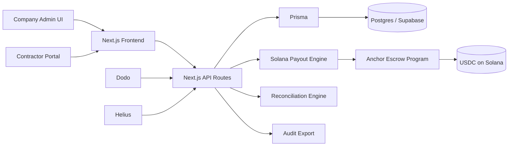
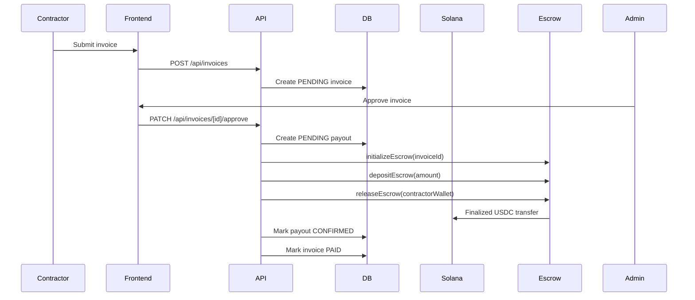
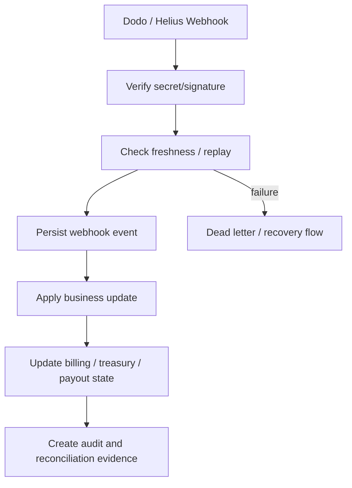

# Borderless Payroll Copilot

[](#tech-stack)
[](#tech-stack)
[](#solana-setup)
[](#solana-setup)
[](#tech-stack)
[](#tech-stack)
[](#license)

**Programmable stablecoin payroll infrastructure for global teams.**

Borderless Payroll Copilot is a Solana-based payroll and treasury operations platform for companies paying global contractors in USDC. It combines programmable escrow, real-time treasury monitoring, batch and split payouts, webhook-backed billing, and audit-grade reconciliation into a single enterprise workflow.

Built for:

- hackathon judges evaluating technical depth and product clarity
- developers and open-source contributors
- fintech and infrastructure companies exploring programmable payroll
- investors and enterprise reviewers looking for operational credibility

## Highlights

- Escrow-backed payroll releases using a Solana Anchor program
- Stablecoin settlement with treasury visibility and payout traceability
- Batch payouts and 95/5 split settlements
- Dodo checkout, usage reporting, and signed webhook handling
- Helius treasury monitoring and webhook-driven treasury reconciliation
- Prisma/Postgres audit records, reconciliation evidence, and CSV export
- Role-aware operator and contractor experiences in Next.js

## Architecture at a glance

- **Frontend:** Next.js App Router, TypeScript, Tailwind, React Query, Zustand
- **Backend:** Next.js API routes, Prisma, Postgres/Supabase
- **Smart contracts:** Solana Anchor escrow program
- **Payments:** USDC on Solana devnet
- **Webhooks:** Dodo for billing, Helius for treasury monitoring
- **Ops:** reconciliation engine, recovery workflows, audit export

---

## Problem Statement

Global contractor payroll is still fundamentally broken for modern internet-native companies.

### The operational problems

- **Payment delays:** international wires and legacy processors delay contractor settlement by days
- **Reconciliation burden:** finance teams reconcile banking rails, spreadsheets, invoices, and support threads manually
- **Limited auditability:** proof of payment often lives across disconnected systems
- **Escrow friction:** traditional payroll systems do not support programmable release conditions
- **Treasury blind spots:** teams lack real-time visibility into available balance and outbound payroll state
- **Cross-border complexity:** FX spreads, settlement fees, and fragmented rails make small global payouts inefficient

### Why traditional systems fail

Traditional payroll infrastructure was not designed for:

- globally distributed contractor workforces
- instant digital-dollar settlement
- programmable payout controls
- real-time treasury monitoring
- API-native auditability

---

## Solution Overview

Borderless Payroll Copilot turns payroll into programmable finance infrastructure.

### What the platform does

- funds a USDC treasury on Solana
- accepts and validates contractor invoices
- routes payouts through programmable escrow
- releases payroll on-chain with transaction-level proof
- monitors treasury movement through Helius webhooks
- reconciles blockchain events back to application state
- exports audit-ready evidence for finance and compliance teams

### Why this matters

This is not just a wallet or transfer experience. It is an operational system for:

- **controlled release of funds**
- **verifiable stablecoin settlement**
- **traceable treasury movement**
- **idempotent webhook processing**
- **enterprise-grade visibility**

---

## Core Features

## 1. Escrow Smart Contracts

The escrow layer is built with an Anchor program in [`programs/escrow/src`](/d:/4th%20sem/Solana-Hackathon/programs/escrow/src).

Capabilities:

- deterministic escrow PDA derivation per invoice
- escrow initialization tied to invoice identity and treasury authority
- USDC vault management through associated token accounts
- controlled release to contractor wallet
- on-chain proof of payout completion

## 2. Payroll Execution

The payroll engine:

- validates invoice and contractor state
- creates a payout record in Postgres
- initializes escrow
- deposits treasury USDC into the vault
- releases funds to the contractor
- stores the final Solana transaction signature

## 3. Batch Payouts

For real payroll cycles, the platform supports atomic batch payout execution:

- multiple approved invoices in one flow
- one transaction signature for the entire batch
- recipient ATA auto-creation when needed
- batch reconciliation evidence persisted

## 4. Split Settlements

The platform supports programmable split routing:

- 95% to contractor
- 5% to fee wallet
- atomic transaction execution
- explorer-verifiable outcome

This is useful for:

- platform fees
- embedded payroll products
- marketplace-like settlement models

## 5. Treasury Monitoring

Treasury visibility is a first-class part of the product:

- live treasury balance fetch from Solana RPC
- persisted treasury balance snapshots in Postgres
- Helius webhook processing for incoming/outgoing token transfers
- treasury transaction history linked to company state

## 6. Webhook Infrastructure

The system processes:

- **Dodo webhooks** for billing state changes
- **Helius webhooks** for treasury activity

Each webhook path includes:

- signature/secret validation
- replay protection
- idempotent processing
- recovery queue support on failure

## 7. Audit Exports

Audit export capabilities include:

- payout CSV export
- invoice export
- treasury transaction export
- webhook event export
- reconciliation export

## 8. Replay Protection

Webhook freshness and nonce validation are built in to reduce duplicate processing risk in production environments.

## 9. Idempotent Processing

Idempotency matters for infrastructure. The platform prevents double effects across:

- billing events
- treasury events
- confirmed payouts
- duplicate invoice payout attempts

---

## Architecture

## High-level architecture



## Payout lifecycle



## Webhook and reconciliation flow



## Layered explanation

### Frontend

- App Router pages for dashboard, contractor portal, onboarding, compliance, operations, analytics
- client-side data hooks using React Query
- treasury, invoice, payout, and audit UI

### Backend

- Next.js route handlers under `app/api`
- auth enforcement with Supabase JWT verification
- business services under `lib/services`

### Smart contract layer

- Anchor escrow program
- runtime IDL in [`lib/solana/idl/escrow.json`](/d:/4th%20sem/Solana-Hackathon/lib/solana/idl/escrow.json)
- escrow lifecycle managed from TypeScript service layer

### Database layer

- Prisma schema in [`prisma/schema.prisma`](/d:/4th%20sem/Solana-Hackathon/prisma/schema.prisma)
- tables for invoices, payouts, audit logs, webhook events, treasury transactions, reconciliation audits

### Webhook flow

- Dodo webhooks update billing state and company subscription context
- Helius webhooks update treasury transaction records and treasury balance state

### Reconciliation engine

- records payout failures
- records confirmation mismatches
- records treasury inconsistencies
- powers operational visibility in `/operations`

---

## Tech Stack

| Layer | Technology | Purpose |
| --- | --- | --- |
| Frontend | Next.js 14 App Router | UI, routing, server/client rendering |
| Language | TypeScript | Type-safe application code |
| Styling | Tailwind CSS | UI styling |
| UI State | React Query, Zustand | data fetching and local UI state |
| Charts | Recharts | analytics and dashboard visualizations |
| Auth | Supabase Auth | JWT-backed user identity |
| ORM | Prisma | database access and schema management |
| Database | Postgres / Supabase | operational persistence |
| Blockchain SDK | `@solana/web3.js`, `@solana/spl-token` | token and wallet interactions |
| Smart Contracts | Anchor | escrow program development |
| Chain | Solana devnet | stablecoin settlement environment |
| Billing | Dodo | hosted checkout and usage billing |
| Treasury Monitoring | Helius | webhook-based treasury visibility |
| Wallet UX | Phantom Wallet Adapter packages | intended wallet-connect integration path |

### Wallet adapter note

The repository includes Solana wallet adapter dependencies and wallet runtime scaffolding. The current dashboard wallet control is a setup placeholder in this build, but the integration path is centered on Phantom-compatible Solana wallet adapters.

---

## Repository Structure

```text
.
├─ app/                     # Next.js routes, pages, and API handlers
├─ components/              # reusable UI and layout components
├─ config/                  # environment and app configuration
├─ docs/                    # architecture, demo, QA, and operational docs
├─ hooks/                   # client-side data hooks
├─ lib/
│  ├─ auth/                 # auth verification and admin guards
│  ├─ db/                   # Prisma client and queries
│  ├─ integrations/         # Dodo integration layer
│  ├─ services/             # business logic
│  └─ solana/               # escrow, transfer, token, and IDL logic
├─ prisma/
│  ├─ migrations/           # database migrations
│  └─ schema.prisma         # Prisma schema
├─ programs/
│  └─ escrow/               # Anchor escrow smart contract
├─ public/                  # static assets
├─ scripts/                 # validation, deployment, and operational scripts
├─ styles/                  # global styles
├─ tests/                   # unit, integration, and E2E tests
├─ types/                   # shared TypeScript types
├─ Anchor.toml              # Anchor workspace config
├─ package.json             # Node scripts and dependencies
└─ README.md
```

### Major folders

| Path | Purpose |
| --- | --- |
| `app/dashboard` | operator treasury and payroll UI |
| `app/contractor` | contractor-facing portal |
| `app/compliance` | payout ledger and export UX |
| `app/operations` | operational recovery and reconciliation UI |
| `app/api` | backend route handlers |
| `lib/services` | core business workflows |
| `lib/solana` | chain interaction and escrow orchestration |
| `programs/escrow` | Anchor on-chain logic |
| `prisma/migrations` | versioned DB migrations |
| `scripts` | validation and certification entrypoints |
| `tests` | automated verification coverage |

---

## Environment Setup

Use `.env.example` as the canonical template. Do not commit real secrets.

### Core application variables

| Variable | Required | Description |
| --- | --- | --- |
| `NEXT_PUBLIC_SOLANA_NETWORK` | yes | `devnet` for current project validation |
| `NEXT_PUBLIC_SOLANA_RPC_URL` | yes | browser RPC endpoint |
| `NEXT_PUBLIC_SUPABASE_URL` | yes | Supabase project URL |
| `NEXT_PUBLIC_SUPABASE_ANON_KEY` | yes | browser auth key |
| `DATABASE_URL` | yes | Prisma runtime connection string |
| `DIRECT_URL` | recommended | direct DB connection for migrations |
| `SUPABASE_SERVICE_ROLE_KEY` | yes | privileged server-side Supabase access |
| `SUPABASE_URL` | yes | alternate Supabase URL used by scripts |

### Solana and escrow variables

| Variable | Required | Description |
| --- | --- | --- |
| `SOLANA_RPC_URL` | yes | server-side Solana RPC |
| `DEVNET_USDC_MINT` | yes | devnet USDC mint |
| `TREASURY_WALLET_SECRET_KEY` | yes | treasury signer secret, base58 64-byte secret key |
| `TREASURY_WALLET_ADDRESS` | yes | treasury public address |
| `TREASURY_WALLET_WHITELIST` | recommended | explicit allowlist for treasury safeguards |
| `ESCROW_PROGRAM_ID` | yes | deployed Anchor program ID |
| `ALLOWED_ESCROW_PROGRAM_IDS` | recommended | explicit allowlist for contract safety |
| `RECIPIENT_WALLET_BLACKLIST` | optional | recipient denylist |

### Billing and webhook variables

| Variable | Required | Description |
| --- | --- | --- |
| `DODO_API_KEY` | yes for billing | Dodo API access |
| `DODO_API_BASE_URL` | optional | Dodo API override |
| `DODO_WEBHOOK_SECRET` | yes | Dodo webhook verification |
| `HELIUS_WEBHOOK_SECRET` | yes | Helius webhook verification |

### App and operations variables

| Variable | Required | Description |
| --- | --- | --- |
| `APP_ORIGIN` | yes | expected app origin |
| `APP_BASE_URL` | yes | base URL for validations and webhooks |
| `ADMIN_BEARER_TOKEN` | required for ops scripts | admin token for certifications |
| `NEXT_PUBLIC_JUDGE_MODE` | optional | enables judge/demo helpers |
| `JUDGE_MODE` | optional | server-side judge/demo support |
| `RESEND_API_KEY` | optional but recommended | contractor rejection email delivery |
| `SENTRY_DSN` | optional | observability |

### Example bootstrap

```bash
cp .env.example .env
```

Then populate the values before running the app.

---

## Local Development Setup

## 1. Install dependencies

```bash
npm install
```

## 2. Generate Prisma client

```bash
npx prisma generate
```

## 3. Apply database migrations

For an existing configured database:

```bash
npx prisma migrate deploy
```

For local development iteration:

```bash
npx prisma migrate dev
```

## 4. Start the Next.js app

```bash
npm run dev
```

Open:

```text
http://localhost:3000
```

## 5. Optional developer verification

```bash
npm run typecheck
npm test
npm run build
```

---

## Solana Setup

## Devnet

This repository is currently validated around **Solana devnet**.

Configure Solana CLI:

```bash
solana config set --url https://api.devnet.solana.com
```

## Treasury wallet

Create a treasury keypair:

```bash
solana-keygen new --no-bip39-passphrase -o ~/.config/solana/id.json
solana address -k ~/.config/solana/id.json
```

Export the base58 secret for `.env`:

```bash
node -e "const fs=require('fs');const m=require('bs58');const b=m.default||m;const a=JSON.parse(fs.readFileSync(process.env.HOME+'/.config/solana/id.json','utf8'));console.log(b.encode(Uint8Array.from(a)));"
```

Fund with SOL:

```bash
solana airdrop 2 <TREASURY_WALLET_ADDRESS> --url devnet
solana balance <TREASURY_WALLET_ADDRESS> --url devnet
```

## USDC mint

The default devnet USDC mint used by this project is:

```text
Gh9ZwEmdLJ8DscKNTkTqPbNwLNNBjuSzaG9Vp2KGtKJr
```

Fund the treasury ATA with devnet USDC before running live payroll validations.

Verify token accounts:

```bash
spl-token accounts --owner <TREASURY_WALLET_ADDRESS> --url devnet
```

## Escrow deployment

Build and deploy the Anchor program:

```bash
npm run anchor:build
npm run anchor:deploy
```

Verify deployment:

```bash
npm run verify-program
```

## IDL sync

Copy the generated Anchor IDL into the runtime location used by the app:

```bash
npm run sync-idl
```

Runtime-critical file:

- [`lib/solana/idl/escrow.json`](/d:/4th%20sem/Solana-Hackathon/lib/solana/idl/escrow.json)

---

## Dodo Setup

## What Dodo is used for

Dodo provides:

- hosted checkout
- subscription context
- usage reporting
- billing webhooks

## Required setup

1. create a Dodo developer account
2. generate `DODO_API_KEY`
3. configure webhook secret as `DODO_WEBHOOK_SECRET`
4. point the webhook to:

```text
https://<APP_BASE_URL>/api/webhooks/dodo
```

## Replay protection

The webhook handler is designed to be:

- signed
- persisted
- idempotent
- replay-aware

Validation command:

```bash
npm run phase4:dodo
```

---

## Helius Setup

## What Helius is used for

Helius provides:

- Solana RPC access
- treasury movement monitoring
- webhook delivery for token transfer events

## Required setup

1. create a Helius account
2. set `SOLANA_RPC_URL`
3. configure `HELIUS_WEBHOOK_SECRET`
4. point the webhook to:

```text
https://<APP_BASE_URL>/api/webhooks/helius
```

## Treasury monitoring behavior

The platform uses Helius to:

- detect treasury token transfers
- persist treasury transaction records
- update treasury balance state
- feed reconciliation and operations views

Validation command:

```bash
npm run phase4:helius
```

---

## Running Validations

The project includes end-to-end operational validation scripts.

| Command | Purpose |
| --- | --- |
| `npm run phase4:validate-anchor` | validate Anchor deployment, IDL, vault ownership, and program state |
| `npm run phase4:live-payroll` | run escrow-backed live payroll flow |
| `npm run phase4:batch` | validate batch payout flow |
| `npm run phase4:split` | validate 95/5 split settlement |
| `npm run phase4:dodo` | validate Dodo webhook signature + idempotency |
| `npm run phase4:helius` | validate Helius treasury webhook flow |
| `npm run phase4:recovery` | validate recovery scenarios |
| `npm run phase4:certify` | run production certification checks |
| `npm run phase4:report` | generate final validation report |

Typical sequence:

```bash
npm run phase4:setup-devnet
npm run phase4:validate-anchor
npm run phase4:live-payroll
npm run phase4:batch
npm run phase4:split
npm run phase4:dodo
npm run phase4:helius
```

---

## Testing

## Unit tests

Run:

```bash
npm test
```

Covers:

- payout logic
- invoice logic
- billing logic
- env validation
- audit CSV helpers

## Integration tests

Located under `tests/integration`.

Coverage includes:

- auth guard routes
- invoice flow
- payout flow
- billing flow
- Helius webhook flow

## E2E tests

Located under `tests/e2e`.

Includes:

- full app flow checks
- devnet payroll flow checks

Run devnet E2E helper:

```bash
npm run test:e2e:devnet
```

## Webhook tests

Operational webhook validations:

```bash
npm run phase4:dodo
npm run phase4:helius
```

---

## Security Architecture

Security is built into multiple layers of the stack.

## Escrow guarantees

- payout release happens through the Anchor escrow program
- funds are deposited into an escrow-controlled vault before release
- finalized transaction confirmation is required before payout is treated as confirmed

## Webhook signature validation

- Dodo webhook secret verification
- Helius shared secret verification
- invalid signatures are rejected

## Replay protection

- freshness checks
- nonce-based replay protection
- persisted webhook identity for idempotent handling

## Idempotency

- duplicate billing events do not create duplicate DB effects
- duplicate payout attempts are blocked
- batch payouts validate invoice eligibility before execution

## Treasury safeguards

- treasury wallet allowlist support
- escrow program allowlist support
- recipient restrictions and blacklist support
- treasury balance reconciliation tracking

## Row-level and tenant safety

- Supabase-backed auth
- tenant membership checks through `CompanyUser`
- contractor scope enforcement
- RLS support via [`prisma/rls-policies.sql`](/d:/4th%20sem/Solana-Hackathon/prisma/rls-policies.sql)

---

## Demo Walkthrough

Concise live-demo flow:

1. open `/dashboard`
2. show treasury balance and explorer link
3. open `/contractor/invoices/new`
4. submit contractor invoice
5. return to `/dashboard`
6. approve invoice
7. show payout explorer transaction
8. open `/contractor`
9. show contractor-side payout visibility
10. open `/compliance`
11. export audit CSV
12. open `/operations`
13. show reconciliation and treasury monitoring

Additional documentation:

- [`docs/DEMO_SCRIPT.md`](/d:/4th%20sem/Solana-Hackathon/docs/DEMO_SCRIPT.md)
- [`docs/FRONTEND_QA_AND_DEMO_GUIDE.md`](/d:/4th%20sem/Solana-Hackathon/docs/FRONTEND_QA_AND_DEMO_GUIDE.md)

---

## Production Readiness

This repository is structured to demonstrate enterprise-oriented operational design, not just a prototype UI.

## Built-in production concerns

- signed webhook handling
- treasury monitoring
- reconciliation evidence
- payout failure tracking
- audit export
- operational recovery endpoints
- environment validation

## Deployment considerations

For production deployment, review:

- secure secret storage
- paid Solana RPC provider
- managed Postgres with backups and PITR
- webhook endpoint hardening
- treasury key custody model
- contract audit before mainnet
- stricter policy enforcement for recipients and treasury controls

Recommended production surfaces:

- `/api/health`
- `/operations`
- `/enterprise-admin`

Relevant docs:

- [`docs/production-setup-guide.md`](/d:/4th%20sem/Solana-Hackathon/docs/production-setup-guide.md)
- [`docs/security-architecture.md`](/d:/4th%20sem/Solana-Hackathon/docs/security-architecture.md)
- [`docs/final-operational-validation-report.md`](/d:/4th%20sem/Solana-Hackathon/docs/final-operational-validation-report.md)

---

## Future Roadmap

- mainnet rollout with audited contract and treasury controls
- deeper compliance tooling and policy workflows
- treasury forecasting and optimization
- embedded enterprise APIs
- richer audit, export, and case-management tooling
- partner and white-label payroll integrations
- multi-chain settlement abstractions

---

## Team Credits

Replace this section with your final team information before external launch.

| Role | Placeholder |
| --- | --- |
| Product / Demo | Team Member |
| Frontend | Team Member |
| Backend | Team Member |
| Solana / Smart Contracts | Team Member |
| Infra / Compliance / QA | Team Member |

---

## License

MIT License.

If you plan to open-source externally, add a dedicated `LICENSE` file at the repository root to match this README declaration.

